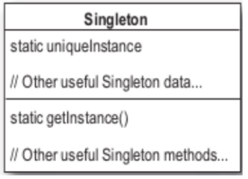

Singleton
============
Permite la creacción de una sola instacia de una clase.
Hay muchos objetos de los cuales necesitamos que exista tan solo uno, por ejemplo, objetos para loguear, objetos que manejan preferencias, drivers, etc. En estos casos el echo de que haya mas de un objeto nos puede llevar a compartamientos incorrectos.
Una manera facil de lograr esto podria ser usando una variable estatica para referenciar el objeto. 
Si bien esto es cierto en java el patron el singleton nos da un punto de acceso global sin los problemas de una varible global como por ejemplo que hay que iniciarla a iniciar la aplicacion, ademas de que no todos los lenguajes de programación soportan varibles estaticas.

Entonces como hacemos para que haya un solo objetos de una clase.

 * Como creamos un objeto: 
 
  ~~~java
     new MyObjet();
  ~~~
  
 * Se puede crear otro objeto de la clase MyObject?
 * Y si no la declaramos publica y la dejamos protected?
 * Y si hacemos esto?
  ~~~java   
     public MyClass(){
         private MyClass(){}
     }
  ~~~
 * Se puede instanciar una clase asi?

   Se podría llamar desde la misma clase pero para esto necesitaria una instancia, y no puedo tener una instancia porque no la puedo instanciar.
   Sería como que esta primero el huevo o la gallina.
 * Y si le agregamos un metodo asi se puede llamar?
  ~~~java   
     public MyClass(){
         private MyClass(){}
         public static MyClass getInstance(){}
     }
  ~~~
  Se puede porque es un método de clase para lo cual no necesitamos una instancia de la clase para llamarlo.
  Asi sería la invocación:
  ~~~java   
     MyClass.getInstance();
  ~~~
Con esto ya casi tenemos la forma de instanciar el objeto con un constructor privado.

Escribamoslo
------------
singleton clasico
-----------------

  ~~~java
    public class Singleton {
    	private static Singleton uniqueInstance;
     
    	private Singleton() {}
     
    	public static Singleton getInstance(){
    		if (uniqueInstance == null) {
    			uniqueInstance = new Singleton();
    		}
    		return uniqueInstance;
    	}
        //resto del codigo
    }
  ~~~
  
Explicación
-----------
  ~~~java
    private static Singleton uniqueInstance;
  ~~~
  Varible estática que guarda una instancia de la clase Singleton.
  
  ~~~java
    private Singleton() {}
  ~~~
  El constructor se declara privado, solo puede ser accedido por Singleton.
  
  ~~~java
    public static Singleton getInstance(){
		if (uniqueInstance == null) {
			uniqueInstance = new Singleton();
		}
		return uniqueInstance;
	}
  ~~~
getInstance() nos da una forma de instanciar la clase y devuelve la unica instncia de Singleton. Solo crea una instancia en el caso de que no haya una guardada en la varible estática y la devulve.
 
La fabrica de chocolate
-----------------------
Vamos a hacer un controlador de una parte del proceso de una fabrica de chocolate. Vamos a controlar un hervidor cuya tarea es llenarse con una mezcla de leche y chocolate y llevarlos a puto de evullicion para recien ahi poder seguir con otra parte del proceso.

El codigo previene de que se pueda vaciar cuando la mezcla todavía no esta hervida o que se pueda llenar cuando esta lleno.
  ~~~java
    public class ChocolateBoiler {
    	private boolean empty;
    	private boolean boiled;
      
    	public ChocolateBoiler() {
    		empty = true;
    		boiled = false;
    	}
      
    
    	public void fill() {
    		if (isEmpty()) {
    			empty = false;
    			boiled = false;
    			// fill the boiler with a milk/chocolate mixture
    		}
    	}
     
    	public void drain() {
    		if (!isEmpty() && isBoiled()) {
    			// drain the boiled milk and chocolate
    			empty = true;
    		}
    	}
     
    	public void boil() {
    		if (!isEmpty() && !isBoiled()) {
    			// bring the contents to a boil
    			boiled = true;
    		}
    	}
      
    	public boolean isEmpty() {
    		return empty;
    	}
     
    	public boolean isBoiled() {
    		return boiled;
    	}
    }
  ~~~
El diseño parace bueno pero nada impida que haya mas de una instacia de la clase ChocoloteBoiler.

Que pasaría se instanciara mas de una instancia de la clase ?
Si lo que tratamos de simular es la existencia de un solo ChocolateBoiler entonces deberíamos tener uno solo controladors.
Si tenemos mas de uno, cada uno tendría su estado aparte y esto no etaria representado la realidad.
Así uno podria estar lleno y el otro no y el metodo fill haría que se vuelva a llenar.

Hagamos ChocolateBoiler única usando singleton

 **ChocolateBoiler**
  ~~~java
  public class ChocolateBoiler {
	private boolean empty;
	private boolean boiled;
	private static ChocolateBoiler uniqueInstance;
  
	private ChocolateBoiler() {
		empty = true;
		boiled = false;
	}
  
	public static ChocolateBoiler getInstance() {
		if (uniqueInstance == null) {
			System.out.println("Creating unique instance of Chocolate Boiler");
			uniqueInstance = new ChocolateBoiler();
		}
		System.out.println("Returning instance of Chocolate Boiler");
		return uniqueInstance;
	}
    //el resto de los métodos
}
  ~~~
  
Patrón Singleton
----------------
Asegura que una clase tenga una sola instacia de ella y da un punto de acceso global a ella.
 * Motivación: 
     * Es importante que algunas clases tengan exactamente una instancia.
     * Para asegurar que la instacia se deja que sea la propia clase la responsable de la cración de su única instancia, quien debe garantizar que no se pueda crear ninguna otra (interceptando las peticiones para crear nuevos objetos) y proporcione un modo de acceder a ella. 

 * Aplicabilidad: Cuando deba haber exactamente una instancia de una clase y ésta debe ser accesible a los clientes desde un punto de acceso conocido.
 * Participantes: 
     * Singleton: Define una operación Instancia que permite que los clientes accedan a su única instancia. 
 Instancia es una operación de clase. Puede ser responsable de crear su única instancia.
 * Consecuencias:
    * Acceso controlado a la única instancia: Encapsula su única instancia, puede tener un control estricto sobre como y cuando acceden a ella los clientes.
    * Espacio de nombres reducido: Es una mejora sobre las variables globales. Evita contaminar el espacio de nombres con variables globales que almacenan las instancias.
    * Permite el refinamiento de operaciones y la representación: Se puede crear una subclase de la clase Singleton, y es fácil configurar una aplicación con una instancia de esta clase extendida, incluso en tiempo de ejecución.
    * Permite un número variable de instancias: Hace que sea fácil permitir mas de una instancia de la clase. Solo se necesitaría cambiar la operación que otorga acceso a la instancia del Singleton.

 * Esctructura:
 * 
 

Trabajando con aplicaciones multi hilos
---------------------------------------

**Hilos**

Los hilos o procesos ligeros son una parte de código o miniprograma que puede ser ejecutada independientemente, de forma que una aplicación o un applet puede tener varios hilos ejecutándose simultáneamente y efectuando distintas tareas; estos hilos se encuentran dentro de un programa y son parte de él.

Los hilos, a veces también llamados contextos de ejecución, pueden ser utilizados para la implementación de algoritmos paralelos o procesos concurrentes, sin ser necesario disponer de equipos con estructura de multiprocesador. En el caso de un solo procesador, los procesos ligeros incorporan mecanismos para compartirlo, estableciéndose prioridades 
entre ellos y también facilidades de sincronización, cuando es necesario.

**Dos hilos ejecutando el codigo** 

  ~~~java
	
	public static ChocolateBoiler getInstance() { //hilo1
	public static ChocolateBoiler getInstance() { //hilo2

		if (uniqueInstance == null) {//hilo1
		if (uniqueInstance == null) {//hilo2
	
			uniqueInstance = new ChocolateBoiler();//hilo1
			uniqueInstance = new ChocolateBoiler();//hilo2
		}
		return uniqueInstance;//hilo1
		return uniqueInstance;//hilo2
	}
    //el resto de los métodos
}
  ~~~
Lo que ocurre es que antes de que haya una instacia de la clase cuando tengo que crear el objeto único, puede ocurrir el caso de que distintos hilos creen distintas instancias, una sola de las cuales va a quedar guardada en la variables estática, pero de acuerdo como se ejecuten los hilos pueda devolver distintos objetos.

Si bien parece poco probable esto puedo ocurrir y debemos buscar la forma de evitar esto.

**Hacer getInstace() un método syncronized**
  ~~~java
    public class Singleton {
    	private static Singleton uniqueInstance;
     
    	private Singleton() {}
     
    	public static syncronized Singleton getInstance(){
    		if (uniqueInstance == null) {
    			uniqueInstance = new Singleton();
    		}
    		return uniqueInstance;
    	}
        //resto del codigo
    }
  ~~~

Agregando el modificador syncronyzed a getInstance(), forzamos a cada hilo a esperar su turno antes de entrar al método.

Esto significa que si un hilo entra al método los demás deben esperar a que termine para poder invocarlo.

El problema de esta implementación es que el uso de syncronized es caro en lo que a performace se refiere.

El problema de que se instacie mas de un objeto de esta clase es la primera vez, pero este método se ejecuta todas las veces que quiero usar el objeto.

Así que una vez que esta instaciado no necesitamos mas que el método sea syncronyzed.

Alternativas para mejorar la performace
---------------------------------------
**No hacer nada si no es importante el tema de la performance**
Tener en cuenta que hacer un método *syncronyzed* puede decrementar la performance en un factor de 100 si hay muchas instanciaciones de getInstance() 

**Crear tempranamente la instacia en ves de la primera ves que la necesito**
Si la aplicación siempre usa la instacia de singleton o la creación y costo de tener un objeto que no se usa instanciado no es grande, entoces esta es una alternativa viable.

  ~~~java
    public class Singleton {
    	private static Singleton uniqueInstance = new Singleton();
     
    	private Singleton() {}
     file:///home/pablo/workspace/filminas/MDSingleton/sincleton.md

    	public static syncronized Singleton getInstance(){
    		return uniqueInstance;
    	}
    }
  ~~~
Usando esta opción le delegamos a la JVM la creacion de la instacia del objeto.
La JVM nos garantiza que cuando la tengamos que usar va a estar disponible.
Inclusive la JVM puede que no la cree hasta que la necesitemos, con lo cual termina siendo lo mismo.

**Sincronizo despues de chequear que no haya una instancia**
Primer chequeamos para ver si hay una instacia creada y si no hay (aca es donde se puede compĺicar), recien ahí sincronizo. 
  ~~~java
    public class Singleton {
    	private volatile static Singleton uniqueInstance;
     
    	public static Singleton getInstance() {
    		if (uniqueInstance == null) {
    			synchronized (Singleton.class) {
    				if (uniqueInstance == null) {
    					uniqueInstance = new Singleton();
    				}
    			}
    		}
    		return uniqueInstance;
    	}
    }
  ~~~
Esta opcion esta disponible en las versiones de java a partir de 1.5

Referencias
-----------
Head First Design Patterns
http://www.ecured.cu/index.php/Patr%C3%B3n_Singleton